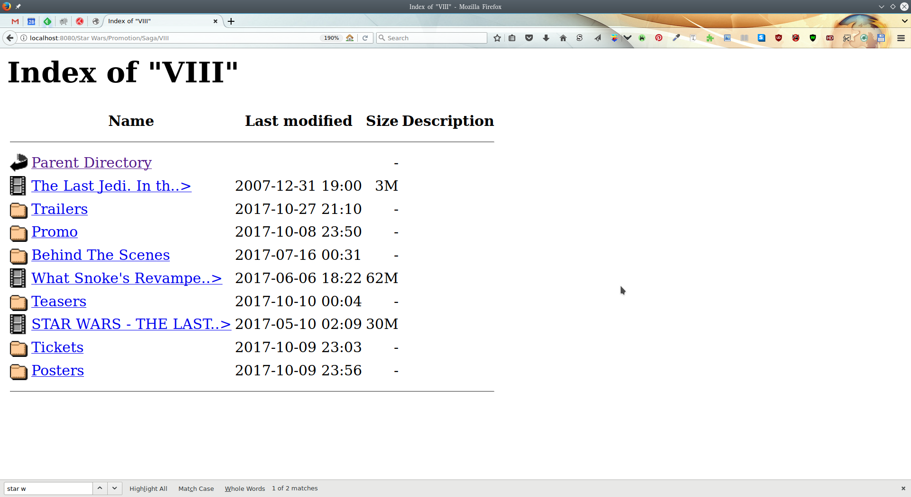

# Requirements

The following requirements are mandatory:
* A recent C++ compiler which fully supports C++11
* [CMake](https://cmake.org)

# How to Build

Note that this program depends on some libraries. `CMake` first download those libraries and then it builds the program.

## How to Build in Linux

You can use the graphical interface of CMake (`cmake-gui`) to generate a `makefile`. If you prefer command line interface, first go to the project path and then execute the following commands:

```
$ mkdir build
$ cd build
$ cmake ..
$ make
```
For more information about using CMake check out this [link](https://cmake.org/runningcmake/).

## How to Build in Windows

You can use the graphical interface of CMake to generate a project (for example Visual Studio project). If you prefer command line interface, first go to the project path and then execute the following commands:

```
mkdir build
cd build
cmake ..
```

Then you can open the generated project with your favorite IDE (e.g. Visual Studio). For more information about using CMake check out this [link](https://cmake.org/runningcmake/).

# Examples

For a complete list of supported features run `./httpfs -h`.

## Using a Web Browser

First we run the server:

```
$ ./httpfs -v --level 3
```

then open `http://localhost:8080` in your favorite browser. You can see the list of files and directories and you can click on them to open a directory or file. If you go to a directory in the top of page there is a link named `Parent Directory` that you can use to return to the parent. The interface is similar to [Apache Http Server](https://httpd.apache.org/). You can see an example in the following image:



## Using httpc

First we run the server:

```
$ ./httpfs -v --level 3
```

Then we can test get command with `httpc`:

```
$ ./httpc -v -h "Accept: text/plain" get "http://localhost:8080"
$ ./httpc -v -h "Accept: application/json" get "http://localhost:8080"
$ ./httpc -v -h "Accept: application/xml" get "http://localhost:8080"
$ ./httpc -v -h "Accept: text/html" get "http://localhost:8080"
$ ./httpc -v -h "Accept: application/xhtml+xml,application/json,text/html,application/xml;q=0.9,*/*;q=0.8" get "http://localhost:8080"
```

The priority of mime types for directory listing:
1. text/html
2. application/json
3. application/xml
4. text/plain

If the client doesn't send `Accept` header or none of the above mime is presented, the server choose HTML format for directory listing. If the GET command points to the directory the content of the file is returned. If it's a directory the list of files and directories in it is returned. You can control the level of subdirectories with `--level` option (it only works for json and xml). The default is 0 which means The content of child directories will not be returned.

Testing post command:

```
$ ./httpc -v post -d "This is foo.txt content" -h "Content-Type: text/plain"  "http://localhost:8080/foo.txt"
$ ./httpc -v get  "http://localhost:8080/foo.txt"
```

# Optional Tasks

## Browsable Directories

I implemented something similar to [Apache Http Server](https://httpd.apache.org/). For handling whitespaces I used two functions for encoding/decoding URLs.

## Multi-Requests Support

It's better to not use a web browser because they cache the data. I've tested them using [mpv](https://mpv.io/) video player which supports URLs. First we run the server:

```
$ ./httpfs -v --level 3 --no-cache
```

Then I try to watch a movie using two `mpv` istances simultaneously.

```
$ mpv http://localhost:8080/Star%20Wars/I%20am%20your%20father%21%20-%20Star%20Wars%20%5BThe%20Empire%20Strikes%20Back%5D%204K-GJf_tMztOv4.webm &
$ mpv http://localhost:8080/Star%20Wars/I%20am%20your%20father%21%20-%20Star%20Wars%20%5BThe%20Empire%20Strikes%20Back%5D%204K-GJf_tMztOv4.webm &
```

You can check the number of sockets in Linux by the following command:

```
$ watch lsof -i4 -P -a -p $(pgrep httpfs)
```

## Content-Type & Content-Disposition Support

I used [Appache mime.types](https://svn.apache.org/repos/asf/httpd/httpd/trunk/docs/conf/mime.types) file which maps file extension to its equivalent mime type. So when user ask a file, based on its extension I extract it's mime. You can run the server with an updated mime.types with `httpfs -m [path_to_mime.types]`. For more information run `httpfs -h`.

I also implemented `Content-Disposition`. You can run the server with `httpfs -C video -C image` to put `Content-Disposition` in all header responses for all video and image files to suggest to the client they shouldn't show them inline but as an attachment. As another example `httpfs -C video/mp4` only put that header in all video files which belong to `video/mp4` mime for example: *.mp4, *.mp4v and *.mpg4.

# Third-Party Libraries

I've used the following external libraries. You don't need to download them. It's the job of CMake:

* [Asio](https://think-async.com/) for cross-platform socket programming
* [Boost C++ Libraries:](http://www.boost.org/)
    * Boost.Filesystem for facilities to manipulate files and directories, and the paths that identify them
    * Boost Property Tree for generating XML results
    * Boost thread for concurrent read and exclusive write
* [nlohmann json](https://github.com/nlohmann/json) for generating JSON results
* [cxxopts](https://github.com/jarro2783/cxxopts) for command line interface
* [LUrlParser](https://github.com/corporateshark/LUrlParser) for parsing URLs
